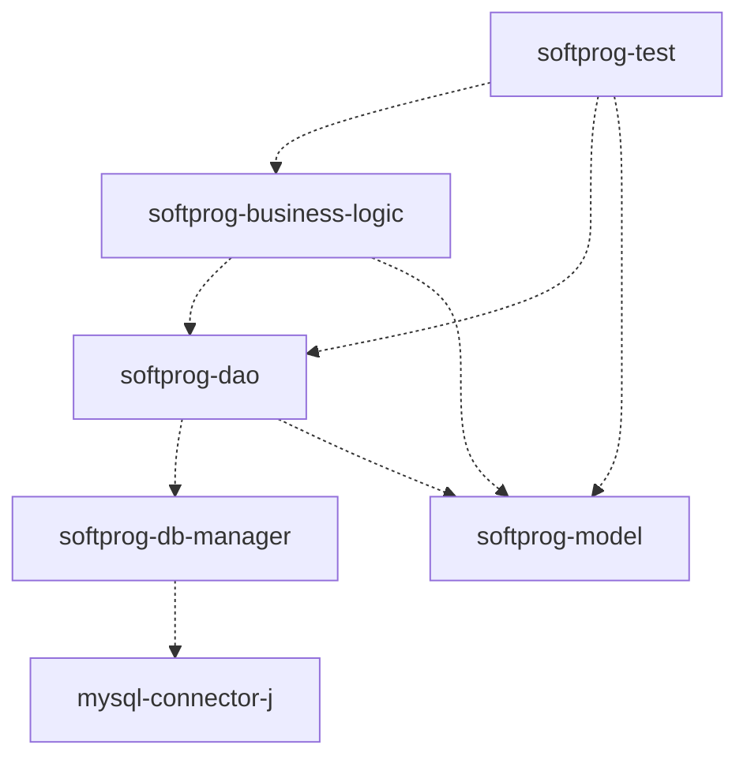

# SoftProg

Welcome to the **SoftProg** project, a multi-tier modular Java enterprise application developed for educational purposes as part of the Database Persistence and Connectivity unit.

This project demonstrates software architecture best practices by strictly separating concerns into different Maven modules. It covers domain modeling, database management, data access operations, and business logic execution.

## Project Structure

This is a multi-module Apache Maven project configured to use **Java 25**. It consists of the following modules and their corresponding dependency graph:



### 1. `softprog-model`
Contains the core domain entities used throughout the application. 
- **Entities:** `Area`, `Customer`, `Employee`, `Product`, `UserAccount`, `SalesOrder`, and `SalesOrderLine`.

### 2. `softprog-db-manager`
Provides the core infrastructure for connecting to the database and managing transactions.
- **Key Components:** `DBManager` (handling the JDBC lifecycle), and `TransactionContext`.

### 3. `softprog-dao`
The Data Access Object (DAO) layer responsible for executing SQL operations (CRUD) against the underlying database.
- **Implementations:** `AreaDAOImpl`, `CustomerDAOImpl`, `EmployeeDAOImpl`, `ProductDAOImpl`, `SalesOrderDAOImpl`.

### 4. `softprog-business-logic`
Encapsulates all the business rules and orchestrates calls between multiple DAOs. This tier ensures data integrity and transaction boundary management.
- **Implementations:** `SalesOrderBLImpl` (manages complex transactions involving headers and lines).
- **Exceptions:** `BusinessLogicException`.

### 5. `softprog-test`
Serves as an integration and entry-point layer to test the implemented components without a full frontend. 
- **Testers:** `TestAreaDAOMain`, `TestProductDAOMain`, `TestSalesOrderBLMain`.

## Prerequisites

- **Java Development Kit (JDK):** Version 25 or higher.
- **Apache Maven:** 3.8+ recommended to build the multi-module project.
- **Database:** Ensure the relational database (e.g., MySQL) is correctly configured with the required schema.

## Database Configuration

Before building or running the application, you **must update your database connection credentials**. Please open the following file and replace the placeholder values with your specific database URL, username, and password:

`softprog-db-manager/src/main/resources/db.properties`

## Build and Execution

To compile the project and install the modules into your local Maven repository, navigate to the root directory (where the parent `pom.xml` is located) and run:

```bash
mvn clean install
```

After building, you can execute the test drivers found in `softprog-test` directly from your IDE to verify the end-to-end database connectivity and transactional behavior.

## Educational Context

This project belongs to the **Programming 3 (2026-01)** course at PUCP. It represents a hands-on approach to mastering:
- Modular application design.
- JDBC-based data persistence.
- Transaction management in a multi-tier architecture.
