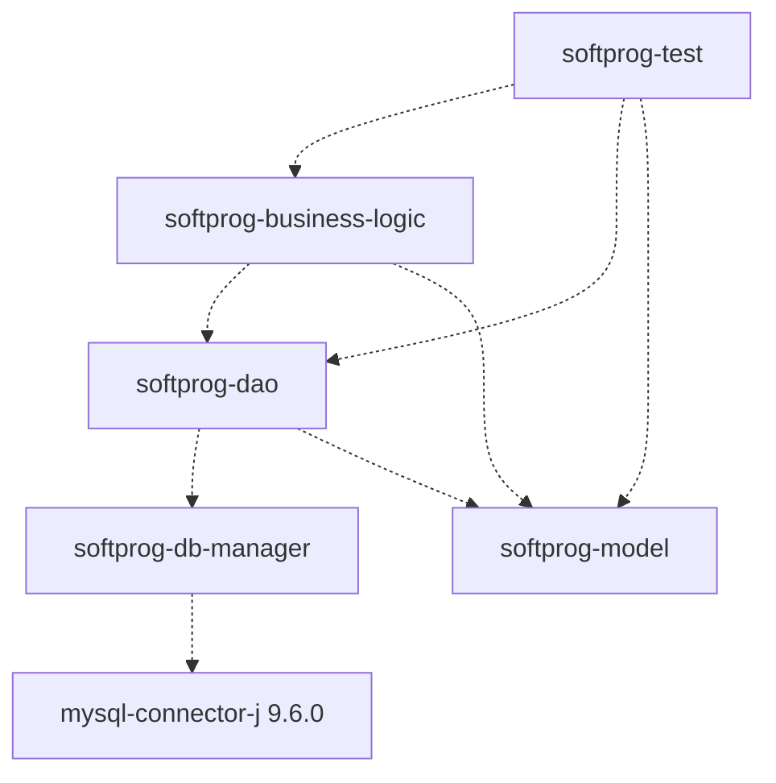

# SoftProg

Welcome to the **SoftProg** project, a multi-tier modular Java enterprise application developed for educational purposes as part of the **Graphical User Interface (GUI) Development** unit.

This project serves as the **back-end data layer** that will be progressively exposed through web services to be consumed by the Blazor front-end and other clients. It demonstrates software architecture best practices by strictly separating concerns into independent Maven modules, covering domain modeling, database management, data access operations, business logic execution, and pagination at the data layer.

## Project Structure

This is a multi-module Apache Maven project configured to use **Java 25** and **MySQL Connector/J 9.6.0**. It consists of the following modules and their corresponding dependency graph:



> [!NOTE]
> Dashed arrows represent compile-time dependencies declared in each module's `pom.xml`. The `softprog-model` module has no internal dependencies, making it the foundational layer consumed by all other modules.

---

### 1. `softprog-model`

Contains the core domain entities that represent the business objects of the application. All other modules depend on this layer.

| Entity | Key Fields |
|:---|:---|
| `Area` | Organizational unit to which employees belong. |
| `Customer` | Inherits from `Person`; adds `creditLine` and `category`. |
| `Employee` | Inherits from `Person`; adds `active` status and associated `Area`. |
| `Product` | Includes `name`, `price`, and `stock`. |
| `UserAccount` | Represents an application user credential. |
| `SalesOrder` | Header entity; contains references to `Employee`, `Customer`, `date`, `total`, `active`, and a `List<SalesOrderLine>`. |
| `SalesOrderLine` | Detail entity; links a `SalesOrder` to a `Product` with `quantity` and `subtotal`. |

The `SalesOrder` entity directly manages its lines through an `addLine(SalesOrderLine)` method, encapsulating the aggregation relationship between a sales order header and its detail lines.

---

### 2. `softprog-db-manager`

Provides the core infrastructure for connecting to the MySQL database and managing transactional boundaries at the JDBC level.

#### `DBManager` — Singleton Connection Factory

Implements the **Singleton** design pattern to ensure a single configuration load from the `db.properties` file across the application lifecycle. It builds the JDBC URL dynamically from the `host`, `port`, and `database` properties and exposes a `getConnection()` method.

```java
// Each call to getConnection() creates a new physical JDBC connection
DBManager.getInstance().getConnection();
```

#### `TransactionContext` — Thread-Local Transaction Manager

Manages a single shared JDBC connection per thread using `ThreadLocal<Connection>`. This ensures that multiple DAO calls within the same business logic operation share the same connection and therefore participate in the same atomic transaction.

```java
// Lifecycle within a single business operation:
TransactionContext.getConnection();  // opens connection with auto-commit=false
// ... DAO operations ...
TransactionContext.commit();         // commits if all steps succeed
TransactionContext.rollback();       // reverts all changes on failure
TransactionContext.close();          // always called in finally; removes from ThreadLocal to prevent memory leaks
```

> [!IMPORTANT]
> Calling `TransactionContext.close()` in the `finally` block is critical in thread-pool environments (e.g., application servers). Failing to remove the connection from the `ThreadLocal` would cause it to be reused by the next request handled by the same thread, leading to corrupted transaction state and connection leaks.

---

### 3. `softprog-dao`

The Data Access Object (DAO) layer responsible for executing SQL operations against the underlying MySQL database. It defines a generic base contract and provides concrete implementations for each entity.

#### `BaseDAO<T, ID>` — Generic CRUD Contract

A generic interface that establishes the standard CRUD operations for any entity type:

```java
public interface BaseDAO<T, ID> {
    T load(ID id) throws SQLException;
    T save(T t) throws SQLException;
    T update(T t) throws SQLException;
    void remove(T t) throws SQLException;
}
```

#### DAO Interfaces and Implementations

Each entity with persistence needs has a corresponding interface and implementation:

| Interface | Implementation | Notable Operations |
|:---|:---|:---|
| `AreaDAO` | `AreaDAOImpl` | Standard CRUD via `BaseDAO` |
| `CustomerDAO` | `CustomerDAOImpl` | CRUD + `totalNumberOfRecords(...)` + `fetchPage(...)` for server-side pagination |
| `EmployeeDAO` | `EmployeeDAOImpl` | Standard CRUD via `BaseDAO` |
| `ProductDAO` | `ProductDAOImpl` | Standard CRUD including stock update via `update(...)` |
| `SalesOrderDAO` | `SalesOrderDAOImpl` | Inserts header and all detail lines in a single `save(...)` operation |

#### Server-Side Pagination in `CustomerDAOImpl`

`CustomerDAO` extends `BaseDAO` with two additional methods that implement server-side pagination and filtering using MySQL's `LIMIT`/`OFFSET` clauses:

```java
// Returns the total count matching the filter criteria (for calculating total pages)
int totalNumberOfRecords(String firstName, String lastName, String docNumber) throws SQLException;

// Returns a single page of matching records
List<Customer> fetchPage(String firstName, String lastName, String docNumber,
                         int page, int recordsPerPage) throws SQLException;
```

The `fetchPage` method dynamically builds the SQL `WHERE` clause based on non-empty filter parameters, then appends `ORDER BY` and `LIMIT ?, ?`, computing the offset as `(page - 1) * recordsPerPage`.

---

### 4. `softprog-business-logic`

Encapsulates all business rules and orchestrates calls between multiple DAOs. This tier is responsible for validating inputs, enforcing domain invariants, managing transaction boundaries, and propagating failures through a typed exception.

#### `BusinessLogicException`

A checked exception used throughout the business layer to communicate domain-level failures (e.g., insufficient stock, inactive employee) as distinct from low-level infrastructure errors.

#### `SalesOrderBL` / `SalesOrderBLImpl` — Transactional Sales Order Creation

The `SalesOrderBLImpl.create(SalesOrder)` method orchestrates a **six-step atomic transaction** that spans multiple DAOs:

```
Step 1 → Validate stock availability for every product line
Step 2 → Verify the assigned employee exists and is active
Step 3 → Verify the customer exists
Step 4 → Persist the sales order header and lines (SalesOrderDAO.save)
Step 5 → Decrement stock for each product in the order (ProductDAO.update)
Step 6 → Commit — only reached if all previous steps succeeded
         ↳ On any error: rollback all changes and re-throw BusinessLogicException
         ↳ finally: always close the TransactionContext
```

This structure ensures **atomicity**: either the order and all stock decrements are committed together, or none of them are persisted.

#### `CustomerBL` / `CustomerBLImpl` — Paginated Customer Retrieval

Delegates server-side pagination to `CustomerDAO` and translates `SQLException` into `BusinessLogicException` to keep the caller isolated from JDBC-level concerns:

```java
int totalNumberOfRecords(String firstName, String lastName, String docNumber);
List<Customer> fetchPage(String firstName, String lastName, String docNumber, int page, int recordsPerPage);
```

---

### 5. `softprog-test`

Serves as an integration and entry-point layer to exercise the implemented components end-to-end without requiring a front-end or web container.

| Test Driver | What it exercises |
|:---|:---|
| `TestAreaDAOMain` | Verifies basic CRUD against the `Area` entity via `AreaDAOImpl`. |
| `TestProductDAOMain` | Verifies product retrieval and update operations via `ProductDAOImpl`. |
| `TestCustomerBLMain` | Verifies server-side pagination: calls `totalNumberOfRecords` and `fetchPage` through `CustomerBLImpl`. |
| `TestSalesOrderBLMain` | End-to-end test: loads an employee, a customer, and two products, assembles a `SalesOrder` with two `SalesOrderLine` entries, and invokes `SalesOrderBLImpl.create(...)`. |
| `MainTestEnum` | Demonstrates enum lookup by ID using `TipoCompraEnum.getFromValue(int)`. |
| `TipoCompraEnum` | Enum modeling purchase types (e.g., `ONLINE`, `PRESENCIAL`) with `id` and `description` fields and a reverse-lookup factory method. |

---

## Prerequisites

- **Java Development Kit (JDK):** Version 25 or higher.
- **Apache Maven:** 3.8+ recommended to build the multi-module project.
- **Database:** MySQL instance correctly configured with the required schema.

## Database Configuration

Before building or running the application, update the database connection credentials. Open the following file and replace the placeholder values with your specific `host`, `port`, `database`, `user`, and `password`:

```
softprog-db-manager/src/main/resources/db.properties
```

## Build and Execution

To compile the project and install all modules into your local Maven repository, navigate to the root directory (where the parent `pom.xml` is located) and run:

```bash
mvn clean install
```

After building, run any of the test drivers in `softprog-test` directly from your IDE to verify end-to-end database connectivity and transactional behavior.

## Educational Context

This project belongs to the **Programming 3 (2026-01)** course at PUCP. It provides hands-on exposure to:

- **Modular application design** with Apache Maven multi-module projects.
- **Design patterns**: Singleton (`DBManager`), DAO, and layered architecture.
- **JDBC-based data persistence** using `PreparedStatement`, `ResultSet`, and manual object mapping.
- **Transaction management** with `TransactionContext` and `ThreadLocal` connection isolation.
- **Server-side pagination** using SQL `LIMIT`/`OFFSET` with dynamic filter composition.
- **Business rule enforcement** and typed exception propagation across architectural tiers.
